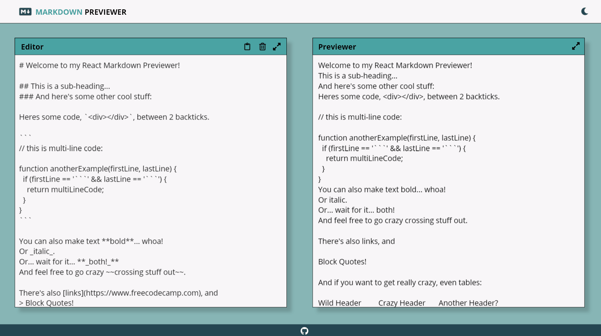

# :zap: Markdown Previewer React App

A responsive React app built for converting user text into markdown preview.

## Design Demo;

From [FreeCodeCamp's](https://www.freecodecamp.org/learn/front-end-libraries/front-end-libraries-projects/build-a-markdown-previewer) Front End Development Libraries Projects. 

## :books: Libraries and Frameworks 

React (Hooks), CSS, Styled Components

## :star: Extra Features I've Added

:sparkles: Designed project layout with Adobe XD in order to provide cleaner design. You can access to my work [here](public/design.xd)

:nail_care: Using [styled components](https://styled-components.com/), upgraded project with dark mode.

:scissors: Introduced copy to clipboard and delete options to the text editor. 
